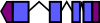
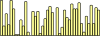
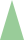

# bio-svgenes

## A Ruby gem for rendering genomic features quickly and easily in SVG format
SVGenes is a Ruby-language library that uses SVG primitives to render typical genomic glyphs through a simple and flexible Ruby interface. 

## Installation

This should be easy - the package is available as a gem. If you have an internet connection try:

	gem install bio-svgenes
	
If this doesn't work try,

	sudo gem install bio-svgenes

## Basic use
0. Design
1. Setting up a page
2. Adding a track
3. Creating and adding features
4. Writing the resulting SVG
5. Styling features
	1. Available glyphs
	2. Setting basic styles: colours and outlines
	3. Setting advanced styles: gradients and arbitrary styles
	4 . Height options for tracks
6. Generating SVG from JSON configuration files
7. File formats

### 1. Design
The library implements a simple Page object (a Bio::Graphics::Page object) that defines the whole drawing area. It carries the horizontal track objects (Bio::Graphics::Track objects). Tracks are the level at which visual information is supplied providing the full styling capability of the SVG standard. 
A glyph type is chosen for each track and all features in a track are rendered with the same glyph any of a selection of defined glyphs. The feature model within SVGenes is simple but flexible and not dependent on particular existing gene feature formats meaning graphics for any existing datasets can easily be created without need for conversion.

To bring the code into your script, load in the gem

	require 'bio-svgenes'

### 2. Setting up a page

The first thing we need to do is set up the page object, a `Bio::Graphics::Page` instance. This defines the attributes of the page into which our features will be drawn.

	p = Bio::Graphics::Page.new(
				 :width => 800, 
	             :height => 200, 
	             :number_of_intervals => 10
	)

The `:width` attribute specifies the minimum width of the page and the `:height` attribute specifies the minimum height. Each of these will be increased if successful rendering requires more room than specified. The `:number_of_intervals` attributes specifies the number of segments to divide the scale into. A scale is always drawn.

### 3. Add a track to the page
Next, we need to add a track to the page. We do this with the `Bio::Graphics::Page#add_track` method. Glyphs are rendered within tracks and tracks define how those glyphs will be styled. In this example we create a `generic` block glyph.

	generic_track = p.add_track(
		:glyph => :generic, 
		:name => 'generic_features', 
		:label => true  
	)
	
The `:name` attribute allows us to define a name for the track and the `:label` attribute explicitly states whether the name should be written onto the track.

### 4. Create a MiniFeature object
Each of the features is represented by a `Bio::Graphics::MiniFeature` object. This is easily created:

	mini_feature = Bio::Graphics::MiniFeature.new(
		:start => 923, 
		:end => 2212, 
		:strand => '+', 
		:id => "MyFeature"
	)

The minimum information you need to provide for a feature is the start and end. In this example, we add a strand and an id for the feature.

#### Add the feature to the track

The feature now needs to be added to the track object to be considered during rendering, we use `Bio::Graphics::Track#add` for this.

	generic_track.add(mini_feature)
	

### 5. Write the output to a file
This process is repeated for all the features and tracks you want to show in the final rendered figure. We then tell the page to render itself to a file.

	p.write("output.svg")
	
	
### 6. Styling features

Selecting a style for the features in a track is done when you create the Bio::Graphics::Track object. The style information is applied to all features that appear in that track. 

#### Available glyphs

A range of glyphs for features are used, namely

	:generic, :directed, :transcript, :histogram, :circle, :down_triangle, :up_triangle, :span

These look like this

+ `:generic` 
+ `:directed` 
+ `:transcript` 
+ `:histogram` 
+ `:circle` 
+ `:down_triangle` 
+ `:up_triangle` 
+ `:span` 

You can specify the glyph to use in the `add_track()` method for the page

	track = page.add_track(
		:glyph => :generic
	)
	
#### Providing enough feature information for the glyph

Different types of glyphs need different types of information to render the feature fully. 
`:generic, :circle, :up_triangle, :down_triangle, :span` glyphs need the minimum feature information, just a start and a stop. Start and end can be the same number if you want to specify a single nucleotide feature.

	track = page.add_track(
	 	:glyph => :circle
	)
	
	feature = Bio::Graphics::MiniFeature.new(
		:start => 100,
		:end => 200
	)
	
	track.add(feature)

In addition, the 'stranded' glyphs `:directed` and `:transcript` need a strand (+ will be assumed if none is provided).

	track = page.add_track(
		:glyph => :circle
	)

	feature = Bio::Graphics::MiniFeature.new(
		:start => 100,
		:end => 200,
		:strand => '-'
	)

	track.add(feature)

The `:histogram` feature is a bit more complicated. Each bar in the histogram is a feature. It's width on the x-axis is specified by it's `:start` and `:end` as for the other features, but it has a `:segment_height` that specifies the bar-height

	data_track = page.add_track(
		:glyph => :histogram
	)
	
	data_feature = Bio::Graphics::MiniFeature.new(
		:start => 100,
		:end => 200,
		:segment_height => 30
    )

	data_track.add(data_feature)
	
Histogram bars can have overlapping or gapped start and end positions if needed. 

Features to be rendered with the `:transcript` glyph need extra information. The exons and utrs are specified as even-numbered lists of start and stop positions. 

	track = page.add_track(
		:glyph => :transcript
	)
	
	feature = Bio::Graphics::MiniFeature.new(
		:start => 100,
		:end => 200,
		:strand => '-',
		:utrs => [100,110,90,200],
		:exons => [120,140,160,180]
	)
	
	track.add(feature)

#### Setting fill and outline colours

Fill and outline colours are specified when creating the track. Any HTML/SVG compatible colour string can be used, so `rgb(125,123,0)` or `#ffff11` or `goldenrod` are all acceptable for each of the following attributes

`:stroke_color` is the outline colour of the glyph
`:stroke_width` is the width of the outline of the glyph
`:fill_color` is the fill colour of the glyph

	track = page.add_track(
		:glyph => :directed,
        :stroke_color => 'black',
        :fill_color => 'gold',
        :stroke_width => '1',
	)
	
Transcript glyphs can have separate colours for the exons and utrs, using `:exon_fill_color` and `:utr_fill_color`. The line joining them can be coloured with `:line_color` and you can decide to have an angled line by setting `:gap_marker` to "angled"

	transcript_track = page.add_track(
		:glyph => :transcript, 
        :exon_fill_color => 'green', 
        :utr_fill_color => 'blue', 
        :line_color => 'black', 
        :gap_marker => 'angled'
	)
	
#### Setting gradients and arbitrary styles

A number of gradient styles are built-in and can be easily used as a fill colour for glyphs. Two basic types `radial` (which start from a white centre and fade to a colour) and `horizontal` (which start from white along the bottom edge and fade to a colour) are available in red, blue, yellow and green. The symbols for the attributes are

	:red_white_radial, :green_white_radial, :blue_white_radial, :yellow_white_radial, :red_white_h, :green_white_h, :blue_white, :yellow_white_h

and are set as
	
	track = page.add_track(
		:glyph => :directed,
    	:stroke_color => 'black',
    	:fill_color => :red_white_h
	)
	
Arbitrary gradients can be built according to the SVG gradient rules (see [SVG gradient linear](http://www.w3schools.com/svg/svg_grad_linear.asp) and [SVG gradient radial](http://www.w3schools.com/svg/svg_grad_radial.asp) ) using a ruby-ish attributes hash.

	my_gradient = {
		
		:radial => "grad1", 
		:cx => 50, 
		:cy => 50, 
		:r => 50, :fx => 50, :
		fy => 50, 
		:stops => [ 
			{
				:offset => 0, 
				:color => 'rgb(255,255,255)', 
				:opacity => 0
				},  
				{
					:offset => 100, 
					:color => 'rgb(0,0,255)', 
					:opacity => 1
				}
		]
	}

simply pass this to the track `:fill_color` attribute.

	track = page.add_track(
		:glyph => :directed,
		:stroke_color => 'black',
		:fill_color => my_gradient
	)

The `:style` attribute can accept and use any arbitrarily complex SVG compliant style tag (see [SVG styling](http://www.w3.org/TR/SVG/styling.html) ). A common use is to modify the opacity of glyphs

	track = page.add_track(
			:glyph => :generic, 
			:style => "fill-opacity:0.4;"
	)

#### Height options for tracks

The height of the glyphs may also be specified. Do this by setting the `:feature_height` attribute

	track = page.add_track(
			:glyph => :generic, 
			:feature_height => 123
	)
	
In data tracks (with the `:histogram` glyph) a maximum value for the y-scale can be specified that will be enforced and prevent the scale from being auto-calculated. This allows for easy comparison between multiple data tracks, use `:max_y`.

	track = page.add_track(
			:glyph => :histogram, 
			:max_y => 1000
	)

### 6. Generating SVG from JSON configuration files

It is also possible to generate the SVG from a [JSON](http://en.wikipedia.org/wiki/JSON) file containing the track information and a reference to file of features in [GFF](http://www.sequenceontology.org/gff3.shtml) format or histogram data in a tab-delimited file. The following sample specifies the page and two tracks, one for features one for data. The new attributes `file` and `file_type` specify the file and file format respectively. 

	{
	"Page":{"width":800, "height":800, "intervals":15},
	"Tracks": [ 
			 {
			  "glyph":"generic",
	          "name":"Genes",
			  "label":true,
			  "file":"gene.gff",
			  "file_type":"gff",
			  "fill_color":"red", 
              "stroke_width":1, 
              "x_round":4,
			  "y_round":4
			 },
			{
			  "glyph":"histogram",
			  "name":"Data",
			  "label":true,
			  "file":"data.txt",
			  "file_type":"data",
			  "track_height":100,
			  "fill_color":"yellow_white_radial",
              "stroke_width":1
			 }
			]
	}

The data file has a simple format, for each bar of the histogram specify one row with three columns
	
	start, end, height

To generate the file, run the provided accessory script `draw_from_json.rb` which is found in the package examples folder. Find the folder the gem installed into with `gem which bio-svgenes`. 
